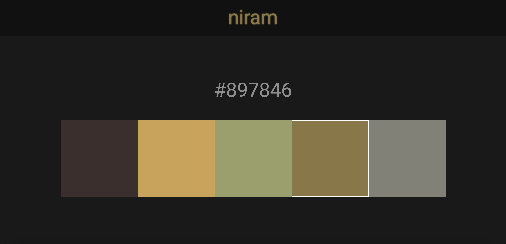

### niram

niram(Tamil for *color*) is an app that I built for learning React and CSS-in-JS.

niram lets you upload an image and displays the 5 most common color codes of that image.

Feel free to create an issue to report a problem or request more features :)

#### License

MIT © [Sivasubramanyam A](https://sivasubramanyam.me)
